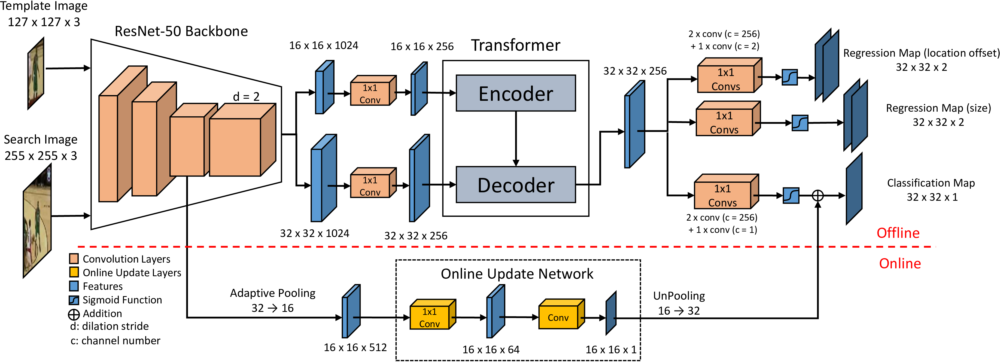

# **TrTr**: Visual Tracking  with Transformer

We propose a novel tracker network based on a powerful attention mechanism called Transformer encoder-decoder architecture to gain  global and rich contextual interdependencies. 
In this new architecture, features of the template image is processed by a self-attention module in the encoder part to learn strong context information, which is then sent to the decoder part to compute cross-attention with the search image features processed by another self-attention module. In addition, we design the classification and regression heads using the output of Transformer to localize target based on shape-agnostic anchor.
We extensively evaluate our tracker TrTr, on several benchmarks and our method performs favorably against state-of-the-art algorithms.

<div align="center">
  
  <p>Network architecture of TrTr for visual tracking</p>
</div>


# Installation

### Install dependencies

```
$ ./install.sh ~/anaconda3 trtr 
```
**note1**: suppose you have the anaconda installation path under `~/anaconda3`.

**note2**: please select a proper cuda-toolkit version to install Pytorch from conda, the default is **10.1**. However, for RTX3090, please select **11.0**. Then the above installation command would be  `$ ./install.sh ~/anaconda3 trtr 11.0`.


### Activate conda environment

```
$ conda activate trtr
```

# Quick Start: Using TrTr

## Webcam demo

### Offline Model

```
$ python demo.py --tracker.checkpoint networks/trtr_resnet50.pth --use_baseline_tracker
```

### Online Model
```
$ python demo.py --tracker.checkpoint networks/trtr_resnet50.pth
```

#### image sequences (png, jpeg)
add option `--video_name ${video_dir}`

#### video (mp4 or avi)
add option `--video_name ${video_name}`


## Benchmarks

### Download testing datasets

Please read [this README.md](datasets/README.md) to prepare the dataset.

### Basic usage

#### Test tracker

```
$ cd benchmark
$ python test.py --cfg_file ../parameters/experiment/vot2018/offline.yaml
```

- `--cfg_file`: the yaml file containing the hyper-parameter for each datasets. Please check `./benchmark/parameters/experiment` for more yaml files
    - online model for VOT2018: `python test.py --cfg_file ../parameters/experiment/vot2018/online.yaml`
    - online model for OTB: `python test.py --cfg_file ../parameters/experiment/otb/online.yaml`
- `--result_path`: optional parameter to specify a directory to store the tracking result. Default value is `results`, which generate `./benchmark/results/${dataset_name}`
- `--model_name`: optional parameter to specify the name of tracker name under the result path. Default value is `trtr`, which yield a tracker directory of `./benchmark/results/${dataset_name}/trtr`
- `--vis`: visualize tracking 
- `--repetition`: repeat number. For example, you should assign `--repetition 15` for VOT benchmark following the official evaluation.

#### Eval tracker

```
$ cd benchmark
$ python eval.py
```

- `--dataset`: parameter to specify the benchmark. Default value is `VOT2018`. Please assign other bench name, e.g., `OTB`, `VOT2019`, `UAV`, etc.
- `--tracker_path`: parameter to specify the result directory. Default value is `./benchmark/results`. This is a parameter related to `--result_path` parameter in `python test.py`. 
- `--num`: parameter to specify the thread number for evaluation multiple tracker results. Default is `1`.


### (Option) Hyper-parameter search
```
$ python hp_search.py --tracker.checkpoint ../networks/trtr_resnet50.pth --tracker.search_sizes 280 --separate --repetition 1  --use_baseline_tracker --tracker.model.transformer_mask True
```

# Train

## Download training datasets

Please read [this README.md](dataset/README.md) to prepare the training dataset.

## Download VOT2018 dataset

1. Please download VOT2018 dataset following [this REAMDE], which is necessary for testing the model during training.
2. Or you skip this testing process by assigning several parameter, which are explained later.

## Test with single GPU

```
$ python main.py  --cfg_file ./parameters/train/default.yaml --output_dir train
```
**note1**: please check `./parameters/train/default.yaml` for the parameters for training
**note2**: `--output_dir` to assign the path to store the training result. The above commmand genearte `./train`
**note3**: maybe you have to modify the file limit: `ulimit -n 8192`. Write in `~/.bashrc` maybe better.
**note4**: you can a larger value for `--benchmark_start_epoch` than for `--epochs` to skip benchmark test. e.g., `--benchmark_start_epoch 21` and `--epochs 20`

#### debug mode for quick checking the training process:
```
$ python main.py  --cfg_file ./parameters/train/default.yaml  --batch_size 16 --dataset.paths ./datasets/yt_bb/dataset/Curation  ./datasets/vid/dataset/Curation/ --dataset.video_frame_ranges 3 100  --dataset.num_uses 100 100  --dataset.eval_num_uses 100 100  --resume networks/trtr_resnet50.pth --benchmark_start_epoch 0 --epochs 10
```

## Multi GPUs

### multi GPUs in single machine
```
$ python -m torch.distributed.launch --nproc_per_node=2 --use_env main.py --cfg_file ./parameters/train/default.yaml --output_dir train
```
`--nproc_per_node`: is the number of GPU to use. The above command means use two GPUs in a machine.


### multi GPUs in multi machines

#### Master Machine
```
$ python -m torch.distributed.launch --nproc_per_node=2 --nnodes=2 --node_rank=0 --master_addr="${MASTER_IP_ADDRESS}" --master_port=${port} --use_env main.py --cfg_file ./parameters/train/default.yaml --output_dir train  --benchmark_start_epoch 8
```
- `--nnodes`: number of machine to use. The above command means two machines.
- `--node_rank`: the id for each machine. Master should be `0`. 
- `master_addr`: assign the IP address of master machine
- `master_port`: open port (e.g., 8080)

#### Slave1 Machine 
```
$ python -m torch.distributed.launch --nproc_per_node=2 --nnodes=2 --node_rank=1 --master_addr="${MASTER_IP_ADDRESS}" --master_port=${port} --use_env main.py --cfg_file ./parameters/train/default.yaml
```